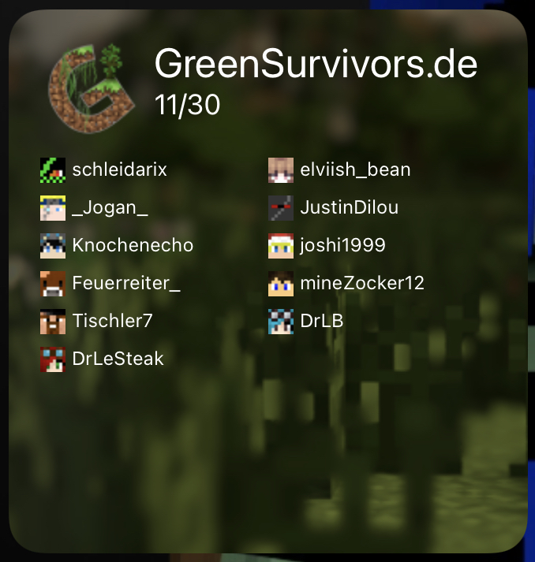

# Serverstatus-Scriptable

Dieses kleine Script erzeugt mit Hilfe der [Scriptable-App](https://apps.apple.com/de/app/scriptable/id1405459188) ein Widget für den iOS und iPadOS Homescreen und zeigt die aktuelle Spielerzahl sowie die aktiven Spieler auf dem Minecraft-Server GreenSurvivors.de an.

## Installation

 1. Lade dir Scriptable aus dem Appstore
 2. Lade dir den aktuellen Release [hier](https://github.com/GreenSurvivors/Serverstatus-Scriptable/releases/latest) auf deinem iOS- oder iPadOS-Device herunter
 3. Öffne die heruntergeladene Datei mit Scriptable (Über die Teilen funktion Scriptable auswählen)
 4. Mit "Add to My Scripts" das Script hinzufügen
 5. Erstelle auf deinem Homescreen ein Scriptable-Widget. Für dieses Script funktionieren nur das mittlere (hier wird nur die Spielerzahl dargestellt) sowie das größte (mit Spielerliste!) Widget.
 6. Spaß haben beim Server-Stalking!
 
 Falls du einen Fehler findest, melde ihn uns doch bitte. Danke!
